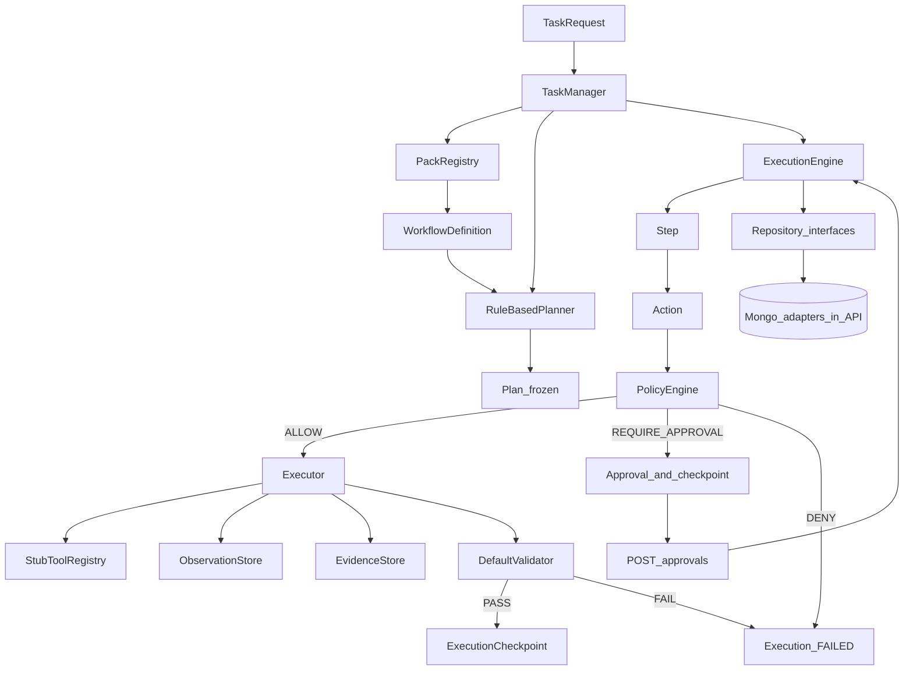

# OpenLifeOps Phase 2 — Real Runtime (revised)

> Replace the hard-coded TaskManager step loop with a **deterministic, resumable, auditable workflow engine**: Planner → Plan (frozen) → Steps → Actions → Policy → Execute → Validate → Checkpoint → Resume/Retry. No Spring AI, MCP, or RAG in this phase.

**Principle:** Build a deterministic operating system that happens to have agents as its eventual reasoning layer. Phase 3 MCP and Phase 5 Spring AI become plugins into a solid runtime — not the things holding the system together.

## Status

| Phase | State |
| --- | --- |
| 1 — Foundation spine | **Complete** |
| 2 — Real runtime | **Complete** |
| 3 — Tool runtime (MCP) | **Next** |
| 4 — Knowledge + Evidence (RAG) | Planned |
| 5 — Intelligence Gateway (Spring AI) | Planned |
| 6 — Tax pack (real reconciliation) | Planned |
| 7 — UI + DX | Planned |

## Where Phase 1 left off

Phase 1 delivered a working spine in [`TaskManager.java`](openlifeops-runtime/src/main/java/com/openlifeops/runtime/TaskManager.java): two **hard-coded** steps, in-memory stores, synchronous run-to-approval. [`TaxPack`](openlifeops-packs/tax/src/main/java/com/openlifeops/packs/tax/TaxPack.java) declares workflow/tools but does not drive execution. Core already has `Action`, `ExecutionStatus`, `Approval` (tied to `actionId`), and `DomainEventPublisher` — Phase 2 refines and completes these.

## Decisions locked (must-have from review)

1. **`ExecutionStatus` is first-class** (already exists; refine vs TaskStatus — see below).
2. **`Action` is the governance unit** — `policyEngine.evaluate(action)`; enrich with `toolId` + parameters.
3. **`Observation` is a separate persisted entity** — never embedded as a giant list on `Execution`.
4. **`Plan` is a frozen workflow snapshot** with `workflowVersion`.
5. **Action-level idempotency** — `(executionId, actionId)` completes at most once.
6. **`Approval` ties to `executionId + actionId`** (already modeled; enforce in API/engine).
7. **Retry = new Execution** — never mutate a failed execution into success.
8. **Core stays Spring-free** — repository interfaces in runtime; Mongo adapters in API.
9. **Planner takes `WorkflowDefinition` (+ step templates)** — not a concrete pack type.
10. **No Spring AI** in Phase 2 — rule planner + deterministic validator only.

## TaskStatus vs ExecutionStatus

Phase 1 used overlapping statuses. Phase 2 separates them:

| Layer | Statuses | Meaning |
| --- | --- | --- |
| **TaskStatus** | `CREATED`, `ACTIVE`, `COMPLETED`, `FAILED`, `CANCELLED` | Aggregate over executions. Task stays `ACTIVE` while any attempt can continue (including after E001 FAILED → retry). Task becomes `FAILED` only when no more retries desired / terminal fail; `COMPLETED` when latest successful path finishes. |
| **ExecutionStatus** | `CREATED`, `RUNNING`, `AWAITING_APPROVAL`, `COMPLETED`, `FAILED`, `CANCELLED` | One attempt. Failed E001 stays `FAILED` forever. |

Example:

```text
Task T001  status=ACTIVE
 ├── Execution E001  attempt=1  FAILED
 └── Execution E002  attempt=2  RUNNING → COMPLETED
Task T001  status=COMPLETED
```

Migrate Phase 1 `PLANNING` / `RUNNING` / `AWAITING_APPROVAL` on Task: map planning+running+awaiting → Task `ACTIVE`; keep execution-level awaiting on `ExecutionStatus` only.

## Target demo (success criteria)

Happy path + **failure + retry** (required in integration tests):

```text
POST /api/v1/tasks  { objective, pack: "tax" }
  → PackRegistry resolves WorkflowDefinition
  → Planner builds frozen Plan (workflowVersion)
  → E001:
       Step 1 READ       → ALLOW → execute → Observation → Evidence → validate → checkpoint STEP_COMPLETED
       Step 2 CALCULATE  → ALLOW → execute → Observation → Evidence → validate → checkpoint STEP_COMPLETED
       Step 3 SUBMIT     → REQUIRE_APPROVAL → Approval(executionId, actionId) → checkpoint APPROVAL_REQUIRED
  → Task=ACTIVE, Execution=AWAITING_APPROVAL

POST /api/v1/tasks/{id}/approvals  { APPROVED, actionId }
  → resume; execute Step 3 once (idempotent); COMPLETED

--- forced failure path (test) ---
E001: Step 2 Validator FAIL → Execution FAILED, Task ACTIVE
POST /api/v1/tasks/{id}/retry
  → E002 attempt=2 from Step 1 (new Plan snapshot allowed; E001 frozen)
  → … → approval → COMPLETED
```

**Persistence proof:** restart API mid-`AWAITING_APPROVAL`; approve after restart — still completes (Mongo).

**Idempotency proof:** double POST approval does not execute Step 3 twice.

## Architecture

```text
                    Task
                     │
                     ▼
                TaskManager
                     │
                     ▼
              PackRegistry
                     │
              WorkflowDefinition
              + WorkflowStepTemplate[] (immutable config)
                     │
                     ▼
                  Planner
                     │
                     ▼
           Plan (frozen, workflowVersion)
                     │
                     ▼
              ExecutionEngine
                     │
             ┌──── Step ────┐
             │              │
             ▼              ▼
           Action        StepStatus
             │
             ▼
        PolicyEngine.evaluate(Action)
        /     |      \
     ALLOW APPROVAL  DENY
       │       │       │
       ▼       ▼       ▼
   Executor  Pause   FAILED
       │     (Approval)
       ▼
 ToolRegistry
       │
       ▼
 Observation  (separate entity)
       │
       ▼
 Evidence     (separate entity)
       │
       ▼
 Validator (deterministic)
       │
    ┌──┴──┐
   PASS  FAIL
    │      │
    ▼      ▼
Checkpoint FAILED
```



## Persistence model (separate collections)

Do **not** embed observations (or large child lists) inside `Execution`.

```text
MongoDB
├── tasks
├── executions          # checkpoint cursor only; no observation blobs
├── plans               # frozen snapshots
├── approvals
├── observations        # refs: taskId, executionId, actionId
├── evidence            # refs: taskId, executionId
└── events              # optional Phase 2; DomainEventPublisher already in-process
```

Repository interfaces live in **runtime** (or a thin store package). Mongo + in-memory adapters live in **API**. Core never depends on Spring Data.

## Module changes

### 1. `openlifeops-core`

| Type | Purpose |
| --- | --- |
| `Plan` | Frozen snapshot: `id`, `taskId`, `executionId`, `workflowId`, **`workflowVersion`**, ordered step snapshots (or step ids + immutable step defs) |
| `WorkflowStepTemplate` | Immutable pack config: `stepKey`, name, order, `ActionType`, target, `RiskLevel`, `toolId` |
| `Observation` | Separate entity: `id`, `taskId`, `executionId`, `actionId`, `output`, `timestamp` |
| `ValidationResult` | `passed`, `message`, optional `evidenceId` |
| `ExecutionCheckpoint` | `executionId`, `planId`, `stepIndex`, `stepId`, `actionId`, **`checkpointType`**, `createdAt` |
| `CheckpointType` | `STEP_COMPLETED`, `APPROVAL_REQUIRED`, `EXECUTION_FAILED` |

**Action** (enrich existing): `id`, `type`, `target`, **`toolId`**, `parameters` (map), `riskLevel`. Policy evaluates Action only.

**Execution** (cursor only): `planId`, `workflowId`, `currentStepIndex`, `pendingActionId`, `pendingStepId`, latest checkpoint fields — **no** embedded `observations` list (store evidenceIds only if kept as thin refs, or query EvidenceStore by executionId).

**Step**: `stepKey`, `StepStatus` (`PENDING`, `RUNNING`, `COMPLETED`, `FAILED`, `SKIPPED`).

**Approval** (enrich): ensure `requestedAt`; decision already has `decidedAt`; status if useful (`PENDING` / `DECIDED`). Always keyed by `taskId` + `executionId` + `actionId`.

**TaskStatus** migration as above (`ACTIVE` replaces planning/running/awaiting on task).

New events: `PlanCreated`, `ExecutionStarted`, `ExecutionCheckpointed`, `ExecutionFailed`, `ValidationFailed` (keep existing `DomainEventPublisher`).

Pack contract: keep `workflows()` / `workflowSteps(workflowId)`; planner consumes resolved `WorkflowDefinition` + templates from registry — not `TaxPack` type.

### 2. `openlifeops-runtime`

| Component | Responsibility |
| --- | --- |
| `PackRegistry` | Resolve pack + `getWorkflow(workflowId)` → definition + templates |
| `Planner` | `Plan plan(Task, WorkflowDefinition, List<WorkflowStepTemplate>)` — produces **frozen** Plan |
| `RuleBasedPlanner` | Maps templates → Steps + Actions; copies version into Plan |
| `Executor` | Invoke tool by `action.toolId`; write Observation + Evidence; **skip if action already completed** (idempotent) |
| `Validator` / `DefaultValidator` | Deterministic only — observation present, evidence present |
| `ExecutionEngine` | Step loop; policy on Action; pause/resume; checkpoint with type; fail |
| `TaskManager` | Create Task/Execution; orchestrate; `approve(taskId, actionId, …)`; `retry()` → new Execution |
| Stores / repos | Interfaces: Task, Execution, Plan, Observation, Evidence, Approval |

Idempotency invariant: **a completed Action must not execute twice within the same Execution.** Enforce via Observation/Evidence presence or an `executedActionIds` set / unique key `(executionId, actionId)`.

### 3. `openlifeops-packs/tax`

Immutable templates for `tax.reconcile.documents` (e.g. `workflowVersion = "1"`):

| Order | stepKey | ActionType | toolId | Risk |
| --- | --- | --- | --- | --- |
| 1 | `read_documents` | READ_DOCUMENT | `tax.read_document` | LOW |
| 2 | `reconcile_ledger` | CALCULATE | `tax.reconcile` | MEDIUM |
| 3 | `submit_report` | SUBMIT_DOCUMENT | `tax.submit_report` | HIGH |

Demonstrates governance: automatic → automatic+validate → human approval.

### 4. `openlifeops-api`

- Mongo adapters implementing runtime repository interfaces
- Profiles: `default` (Mongo), `in-memory` (tests)
- Core stays Spring-free

**REST**

| Method | Path | Behavior |
| --- | --- | --- |
| POST | `/api/v1/tasks` | Pack-driven plan + run |
| GET | `/api/v1/tasks/{id}` | Task + executions + plan/checkpoint + steps; evidence/observations by ref |
| POST | `/api/v1/tasks/{id}/approvals` | Body includes **`actionId`** (and decision); approve that action in pending execution |
| POST | `/api/v1/tasks/{id}/retry` | New Execution if latest is FAILED (or cancelled path); Task remains ACTIVE until terminal |

**Tests (required)**

1. Happy path: 3 steps → approval → COMPLETED (3 evidence + 3 observations)
2. **Failure + retry:** fail Step 2 → E001 FAILED → retry → E002 → approval → COMPLETED
3. **Idempotent approval:** second approval POST is no-op / safe
4. Checkpoint resume unit test on `ExecutionEngine`
5. Optional Testcontainers Mongo restart test

### 5. Docs

Update [`00-openlifeops-platform.md`](../00-openlifeops-platform.md) and [`README.md`](README.md) for Phase 2 scope, Task vs Execution status, Mongo collections, retry/idempotency.

## Explicitly out of scope

- Spring AI / LLM planner or LLM validator
- Real MCP / Playwright
- Document ingest / RAG / pgvector
- Consumer pack
- UI
- Policy YAML engine
- Parallel steps
- Distributed locks (local idempotency only)

## Implementation order

1. Core: TaskStatus reshape, Action.toolId, Plan+workflowVersion, Observation entity, CheckpointType, Approval polish
2. Repository interfaces in runtime; separate ObservationStore
3. TaxPack templates + workflowVersion `"1"`
4. PackRegistry.getWorkflow + RuleBasedPlanner (workflow in, Plan out)
5. Executor + DefaultValidator + idempotency
6. ExecutionEngine + slim TaskManager + approve(actionId) + retry
7. Mongo + in-memory adapters in API
8. REST + tests (happy + fail/retry + idempotent) + docs + verify

## Verification checklist

- [ ] `mvnw.cmd verify` green (`in-memory`)
- [ ] 3-step tax flow; pause on submit; complete after approval
- [ ] Observations and Evidence in separate stores/collections
- [ ] Plan has `workflowVersion`; changing TaxPack later does not mutate old Plans
- [ ] E001 FAILED + E002 COMPLETED; Task ends COMPLETED
- [ ] Double approval does not double-execute
- [ ] Approval requires matching `actionId`
- [ ] Mongo restart mid-approval still resumes
- [ ] No Spring / Mongo in `openlifeops-core`
- [ ] Planner does not depend on `TaxPack` concrete type

## Todos

| ID | Task |
| --- | --- |
| `core-plan-checkpoint` | Plan+version, Observation entity, CheckpointType, Action.toolId, TaskStatus/ExecutionStatus split, Approval polish |
| `tax-workflow-steps` | TaxPack immutable 3-step templates + workflowVersion |
| `planner-validator` | PackRegistry.getWorkflow, RuleBasedPlanner(workflow→Plan), DefaultValidator |
| `execution-engine` | ExecutionEngine, Executor idempotency, TaskManager approve+retry |
| `mongo-persistence` | Repo interfaces + Mongo/in-memory adapters; separate collections |
| `api-retry-checkpoint` | GET enrichment; approvals with actionId; POST retry |
| `phase2-tests-docs` | Happy path + fail/retry + idempotency tests; docs; verify |
