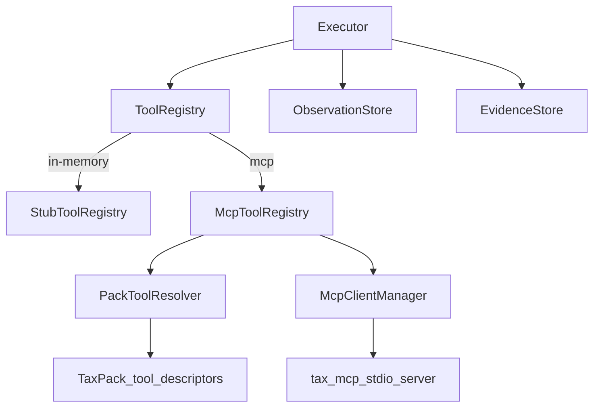

# OpenLifeOps Phase 3 — MCP Tool Runtime

> Replace `StubToolRegistry` with a real **Model Context Protocol** tool layer: discover tools from MCP servers, map pack `toolId`s to MCP tools, invoke through `ToolRegistry`, and keep the Executor/runtime spine unchanged. No Spring AI chat/planning (Phase 5) and no RAG (Phase 4) in this phase.

**Principle:** The runtime already knows *when* to act (Phase 2). Phase 3 makes *how* tools run real — without coupling MCP into `openlifeops-core`.

## Status

| Phase | State |
| --- | --- |
| 1 — Foundation spine | **Complete** |
| 2 — Real runtime | **Complete** (Mongo adapters deferred — see §Phase 2 debt) |
| 3 — MCP tool runtime | **Next** (this plan) |
| 4 — Knowledge + Evidence (RAG) | Planned |
| 5 — Intelligence Gateway (Spring AI) | Planned |
| 6 — Tax pack (real reconciliation) | Planned |
| 7 — UI + DX | Planned |

## Phase 2 debt (optional first slice)

Phase 2 defined Mongo persistence but shipped **in-memory only** (`MongoPersistenceConfig` delegates to in-memory). Before or in parallel with MCP:

| Item | Why |
| --- | --- |
| Mongo document adapters for Task, Execution, Plan, Observation, Evidence, Approval | Restart mid-approval proof; production-shaped persistence |
| `default` profile → Mongo; tests stay `in-memory` | Matches original Phase 2 checklist |

**Recommendation:** Do Mongo as **Phase 3a** (1 focused pass, ~2–3 days) *or* defer if you want MCP momentum first. MCP does not block on Mongo — stub/in-memory is fine for MCP dev.

---

## Where Phase 2 left off

- [`ToolRegistry`](openlifeops-mcp/src/main/java/com/openlifeops/mcp/ToolRegistry.java): `invoke(Action)` → string
- [`StubToolRegistry`](openlifeops-mcp/src/main/java/com/openlifeops/mcp/StubToolRegistry.java): returns `stub-result:{toolId}@{target}`
- [`Executor`](openlifeops-runtime/src/main/java/com/openlifeops/runtime/Executor.java): calls registry; evidence `provenance` = `executor.stub`
- [`TaxPack`](openlifeops-packs/tax/src/main/java/com/openlifeops/packs/tax/TaxPack.java): declares `tax.read_document`, `tax.reconcile`, `tax.submit_report` as `ToolDescriptor`s only

The runtime spine (Planner → ExecutionEngine → Policy → Executor → Validator) must **not** change shape — only what sits behind `ToolRegistry`.

---

## Decisions locked

1. **MCP is the tool abstraction** — agents never call Playwright/APIs directly; they go through `Action.toolId` → `ToolRegistry` → MCP.
2. **Use Spring AI MCP Client Boot Starter** for client transport (stdio first; SSE later). Aligns with “Spring AI directly” for the stack; Phase 5 adds chat/reasoning on top of the same ecosystem. Alternative: official MCP Java SDK only if Spring AI client blocks Boot 4.1 — evaluate in spike.
3. **Core stays Spring-free** — MCP wiring lives in `openlifeops-mcp` + `openlifeops-api` config only.
4. **Profiles:** `in-memory` keeps `StubToolRegistry`; `mcp` (or default when ready) uses `McpToolRegistry`.
5. **Pack maps logical toolId → MCP tool name + server** — not hard-coded in runtime.
6. **One reference MCP server for Tax** — minimal stdio server implementing the three tax tools (can return structured JSON stubs that are richer than today's strings).
7. **No LLM in tool selection** — `toolId` comes from frozen `WorkflowStepTemplate` (Phase 2 planner).
8. **Timeouts and errors** — MCP failures surface as execution failures with retriable semantics (reuse Phase 2 retry).

---

## Target demo (Phase 3 success criteria)

```text
# Terminal 1 — tax MCP server (stdio)
node tax-mcp-server/index.js   # or java -jar tax-mcp-server.jar

# Terminal 2 — OpenLifeOps API (mcp profile)
SPRING_PROFILES_ACTIVE=mcp mvnw -pl openlifeops-api spring-boot:run

POST /api/v1/tasks  { objective, pack: "tax" }
  → Step 1: MCP tool tax.read_document invoked
  → Observation output from MCP (not "stub-result:...")
  → Evidence provenance = "mcp:tax-tools-server"
  → … step 2 reconcile via MCP …
  → Step 3: AWAITING_APPROVAL
POST /approvals { actionId, APPROVED }
  → MCP tax.submit_report invoked once
  → COMPLETED

GET /tasks/{id}
  → observations show MCP JSON payloads
  → evidence provenance references MCP server
```

**Tool discovery proof:** on startup, log or `GET /api/v1/tools` lists tools discovered from configured MCP connections.

**Failure proof:** stop MCP server mid-run → step fails with clear error; `POST /retry` works (Phase 2 retry unchanged).

---

## Architecture

```text
Action.toolId
     ↓
ToolRegistry (interface)
     ├── StubToolRegistry          (@Profile in-memory)
     └── McpToolRegistry           (@Profile mcp)
              ↓
         ToolResolver              (pack toolId → McpToolReference)
              ↓
         McpClientManager          (Spring AI MCP sync clients)
              ↓
         MCP servers (stdio)
              ├── tax-tools         (Phase 3 reference)
              └── (future: filesystem, playwright, …)
```



---

## Module changes

### 1. `openlifeops-core` (minimal)

| Type | Purpose |
| --- | --- |
| `McpToolReference` | record: `serverId`, `mcpToolName`, optional `connectionName` |
| Extend `ToolDescriptor` | optional `mcpToolName` / `mcpServerId` fields, or separate `PackToolBinding` on pack |

Extend `OpenLifeOpsPack`:

```java
default Map<String, McpToolReference> mcpToolBindings() {
    return Map.of();
}
```

`TaxPack` maps `tax.read_document` → MCP tool on `tax-tools` server.

### 2. `openlifeops-mcp` (main work)

| Component | Responsibility |
| --- | --- |
| `ToolRegistry` | keep; consider `ToolInvocationResult` (output, serverId, durationMs) instead of raw `String` |
| `McpToolRegistry` | resolve binding, call MCP, return result |
| `McpClientManager` | lifecycle: connect stdio servers from config, list tools, invoke by name |
| `PackToolResolver` | `toolId` + pack → `McpToolReference` |
| `ToolDiscoveryService` | aggregate tools from all connections; used at startup + optional API |
| `McpToolException` | wrap timeouts, connection errors |

Dependencies (evaluate versions against Boot 4.1):

```xml
<!-- openlifeops-mcp/pom.xml -->
spring-ai-starter-mcp-client
<!-- or mcp Java SDK if starter incompatible -->
```

### 3. `openlifeops-runtime`

| Change | Detail |
| --- | --- |
| `Executor` | use `ToolInvocationResult`; set evidence `provenance` = `mcp:{serverId}` |
| No changes to `ExecutionEngine` / `TaskManager` | tool swap is DI-only |

### 4. `openlifeops-api`

| Item | Detail |
| --- | --- |
| `application-mcp.yml` | stdio connection for `tax-tools` (command, args, env) |
| `McpConfig` | beans: `McpClientManager`, `McpToolRegistry` when profile active |
| `InMemoryPersistenceConfig` | keep `StubToolRegistry` |
| Optional `GET /api/v1/tools` | list discovered MCP tools (debug/DX) |
| Update [`help.md`](help.md) | second terminal for MCP server; `mcp` profile steps |

### 5. Reference MCP server — `tools/tax-mcp-server/`

Minimal **stdio** MCP server (Node or Java — pick one; Node is fastest for a demo):

| MCP tool name | Simulates | Returns |
| --- | --- | --- |
| `tax_read_document` | Form 16 read | JSON: `{ "income": 1200000, "tds": 245000 }` |
| `tax_reconcile` | Ledger reconcile | JSON: `{ "mismatches": 0, "status": "ok" }` |
| `tax_submit_report` | Submit (high risk) | JSON: `{ "submitted": true, "reference": "..." }` |

Pack bindings map OpenLifeOps `toolId` → these MCP names.

Not in scope: real PDF parsing (Phase 4/6).

---

## Configuration sketch

```yaml
# application-mcp.yml
spring:
  profiles:
    active: mcp
  ai:
    mcp:
      client:
        type: SYNC
        toolcallback:
          enabled: true
        stdio:
          connections:
            tax-tools:
              command: node
              args:
                - ../tools/tax-mcp-server/index.js

openlifeops:
  mcp:
    default-server: tax-tools
```

---

## Explicitly out of scope

- Spring AI `ChatClient` / LLM planning (Phase 5)
- RAG / document ingest (Phase 4)
- Playwright / browser MCP (later pack)
- Dynamic tool selection by LLM
- MCP server authoring framework inside OpenLifeOps (one reference server is enough)
- Multi-tenant / remote MCP over SSE in production (stdio first; SSE as stretch)
- Consumer pack

---

## Implementation order

```text
1. Spike: Spring AI MCP client + Boot 4.1 compatibility (half day)
2. core: McpToolReference + pack mcpToolBindings()
3. tax-mcp-server: stdio server with 3 tools
4. openlifeops-mcp: McpClientManager, McpToolRegistry, PackToolResolver
5. Executor: ToolInvocationResult + provenance
6. TaxPack bindings
7. api: mcp profile config + optional GET /tools
8. help.md + README updates
9. Integration test: @ActiveProfiles("in-memory") unchanged; new @ActiveProfiles("mcp") test with embedded/mock MCP or testcontainers
10. mvn verify
```

---

## Verification checklist

- [ ] `mvnw.cmd verify` green (`in-memory` profile tests unchanged)
- [ ] With `mcp` profile + tax server running, observations are MCP JSON (not stub strings)
- [ ] Evidence `provenance` = `mcp:tax-tools` (or configured server id)
- [ ] Tool discovery lists 3 tax tools at startup
- [ ] MCP server down → step fails; retry after server up succeeds
- [ ] Idempotent approval still holds with MCP submit
- [ ] No MCP/Spring imports in `openlifeops-core`
- [ ] `help.md` documents two-terminal manual test

---

## After Phase 3

| Phase | Focus |
| --- | --- |
| 4 | Knowledge: document ingest, chunking, pgvector, citation evidence |
| 5 | Spring AI gateway: model routing, structured planner output (optional LLM planner behind interface) |
| 6 | Tax pack: real PDF reconciliation on top of MCP doc tools |
| 7 | UI: task console, approval, traces, evidence viewer |

Phase 4 + 6 together make Tax real; Phase 5 makes planning intelligent; Phase 3 makes **tool execution** real.

---

## Todos

| ID | Task |
| --- | --- |
| `mcp-spike` | Validate Spring AI MCP client on Boot 4.1; stdio connection works |
| `core-tool-binding` | McpToolReference + OpenLifeOpsPack.mcpToolBindings() |
| `tax-mcp-server` | Reference stdio MCP server with 3 tax tools |
| `mcp-registry` | McpClientManager, McpToolRegistry, PackToolResolver |
| `executor-provenance` | ToolInvocationResult; evidence provenance from MCP |
| `api-mcp-profile` | application-mcp.yml, McpConfig, optional GET /tools |
| `phase3-tests-docs` | mcp integration test, help.md, verify |

**Optional parallel:** `mongo-adapters` — complete Phase 2 persistence (separate todo if chosen).
